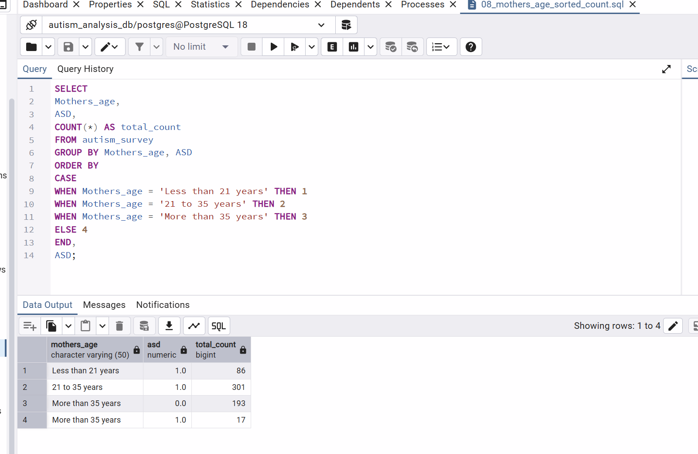

# Portfolio
Main repo for data projects

# Project Name (Autism_survey_analysis)

## Overview
This project showcases my data engineering and analysis skills by taking raw survey data, converting it into a usable format, cleaning and transforming it, and performing exploratory analysis to uncover trends. It demonstrates my ability to handle data end-to-end, from ingestion to actionable insights.

## Goal
The goal of this project is to highlight my capabilities in data engineering and analysis: efficiently processing raw datasets, transforming them for analysis, and generating insights through data exploration and visualization.

## Tools Used
- SQL Server (data storage and querying)
- PostgreSQL
- SSMS (writing queries and managing the database)
- Python (data cleaning, transformation, and visualization)
- Power BI (visualization)
- Git & GitHub

## Process
### Cleaning
1. Format Conversion: Converted raw .sav (SPSS) files to .csv using Python (scripts/convert_sav.py) to enable SQL Server/PostgreSQL ingestion.
2. Schema Mapping: Defined a structured table with 26 clinical variables to ensure data integrity.
3. Data Type Casting: Cleaned "dirty" string data by casting Mothers_age to an INTEGER in PostgreSQL, allowing for mathematical aggregations and sorting.
### Insights
1. Maternal Age Distribution (Query 08):
    - Data Insight: The analysis revealed that the largest group of respondents fell within the [21-35 years] category.\
      This shows our sample is primarily composed of mothers in their early-to-mid thirties.
   
### How to Run
1. Clone the Repository: Download the project folder to your local machine.
2. Database Setup: Execute the SQL scripts in the /Scripts folder to initialize the table structure.
3. Data Import: Import the cleaned data from the /Data folder into your SQL tool (PostgreSQL/SSMS).
4. Analysis: Run the numbered queries to generate the results shown in the Insights section.
   

## Results

08 : Maternal Age Distribution
This query confirms the successful type-casting of the Mothers_age column from a string to an integer, allowing for a sorted frequency distribution.

## Next Steps
Ideas for future improvements or extensions.
6c8756f (Organized folders into Scripts and Images and synced README)
