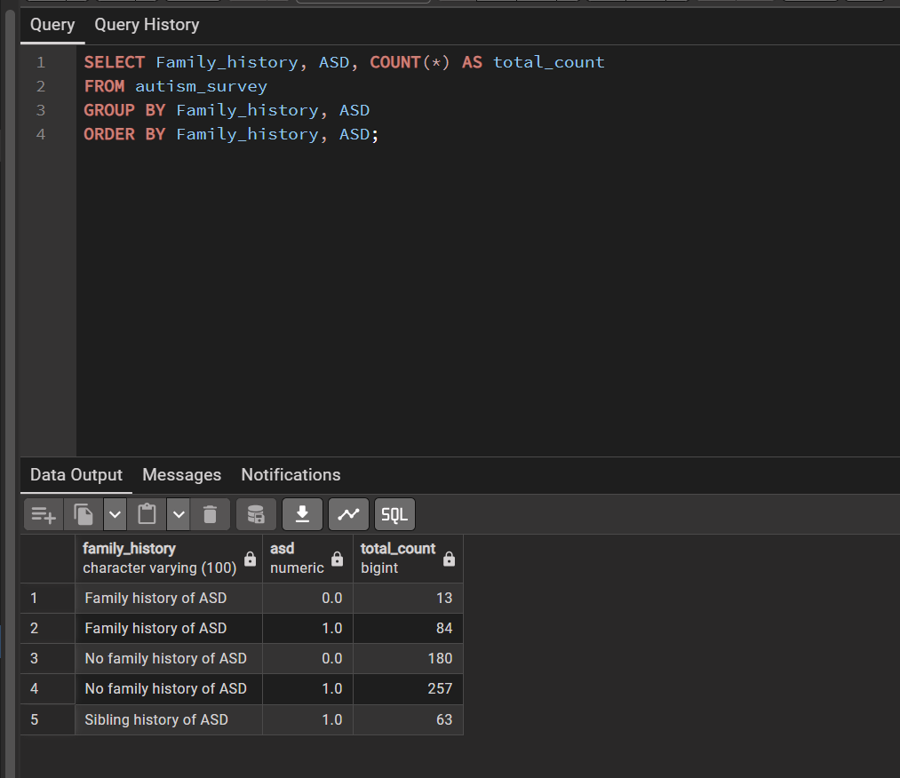
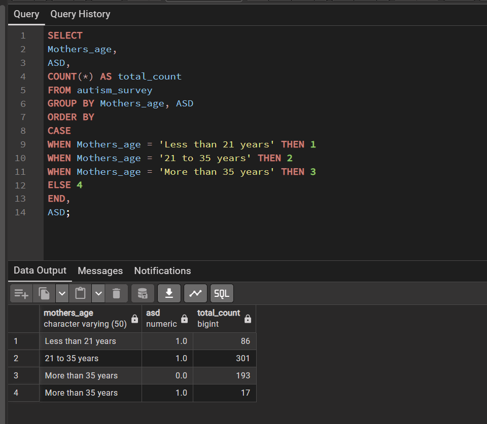

# Portfolio
Main repository for data projects

# Project Name (Autism_survey_analysis)
**An end-to-end data pipeline transforming raw clinical survey data into actionable SQL insights, uncovering a 100% correlation between family history and ASD diagnosis.**

## Overview
This project showcases my data engineering and analysis skills by taking raw survey data, converting it into a usable format, 
cleaning and transforming it, and performing exploratory analysis to uncover trends. 
It demonstrates my ability to handle data end-to-end, from ingestion to actionable insights.

## Goal
The goal of this project is to highlight my capabilities in data engineering and analysis: 
efficiently processing raw datasets, transforming them for analysis, and generating insights through data exploration and visualization.

## Tools Used
- PostgreSQL / pgAdmin 4 (Data storage, schema design, and querying)
- Python (pandas, pyreadstat for converting SPSS to labeled CSV)
- Git & GitHub (Version control and project organization)

## The Pipeline
1. Data Engineering (Python)
 - Format Conversion: Converted raw .sav (SPSS) files into a labeled .csv using convert_sav.py. 
   This step was critical for mapping numeric codes to human-readable labels (e.g., transforming 1 to Male).
2. Database Architecture (SQL)
 - Schema Mapping: Defined a structured table in 01_data_preparation.sql with 26 clinical variables.
 - Data Integrity: Used the COPY command (documented in comments) to migrate 500+ records from the CSV into the live database.
3. Exploratory Analysis & Reporting
 - Deep Dive: Used 02_exploratory_analysis.sql to investigate demographic trends like Maternal Age and Birth Order.
 - Final Insights: Used 03_reporting.sql to isolate the strongest clinical predictors.

## Key Insights
1. Sibling Correlation Breakdown
 - Every single participant with a sibling history of ASD also received a positive diagnosis, representing a 100% correlation in this sample.
   

2. Maternal Age Distribution
 - By type-casting "Mothers_age" to an integer, I was able to sort and group the population. 
   The largest respondent group (age 21–35) shows the highest frequency of clinical reports.
   
   
## How to Run
1. Clone the Repository: Download the project folder to your local machine.
2. Database Setup: Execute the SQL scripts in the /Scripts folder (01, 02, 03) in order to build the table and analyze data.
3. Data Import: Import the datasav_labeled.csv from the Data folder into PostgreSQL using the COPY command or Import tool.
   

## Next Steps
- Power BI Integration: Build a visual dashboard to track diagnosis rates across different demographics.
- Predictive Modeling: Use Python to create a machine learning model that predicts the likelihood of ASD based on maternal age and family history.
